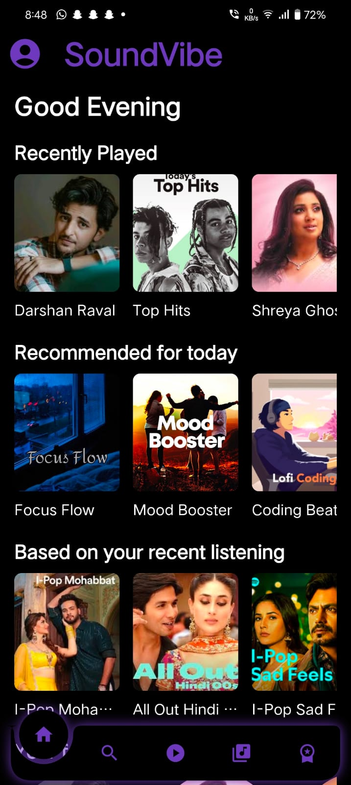
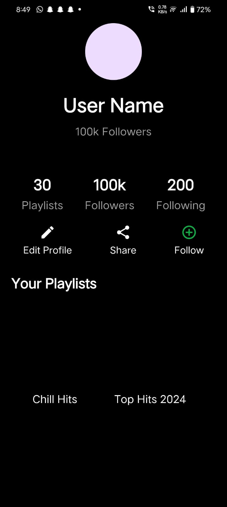
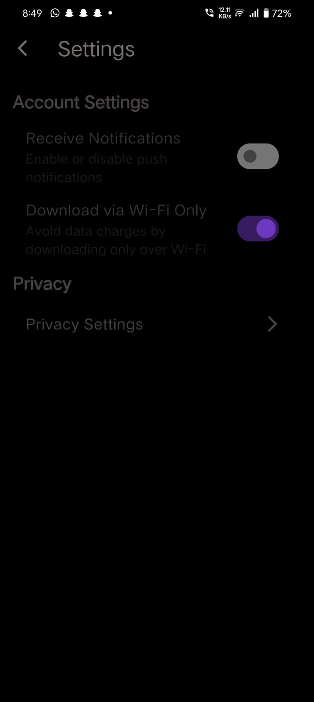
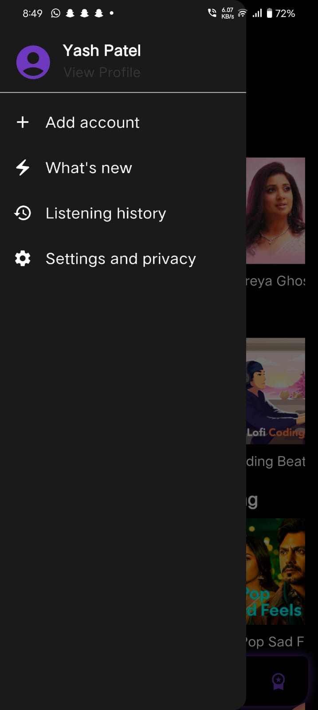
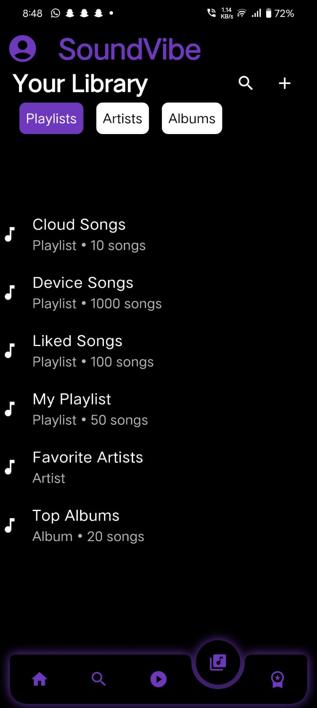
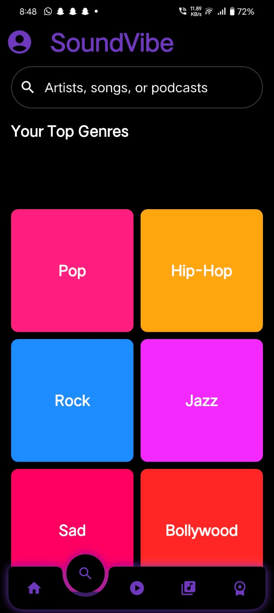
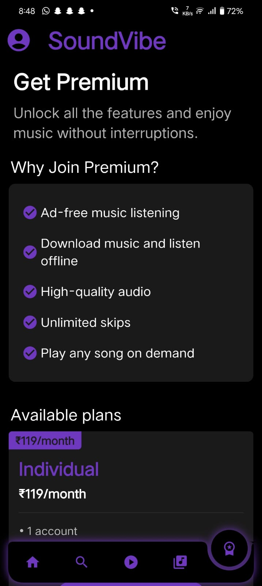

# Flutter Project - SoundVibe

## 📖 About the Project
SoundVibe is a music streaming app that provides a seamless experience for discovering and playing your favorite tracks.

This app is built using Flutter, enabling a cross-platform experience for both Android and iOS.

---

## 🖼️ Screenshots

### Home Screen

### Login Screen

### Profile Screen

### Settings Screen

### Drawer Screen

### Log in options Screen

### Now Playing Screen

### Playlist Screen

### Search Screen

### Sign up options Screen

### Sign up Screen

### Splash Screen

### Subscription Screen

### What's New Screen

---

## 🚀 Features
- 🎨 **Cross-Platform**: Runs on both Android and iOS.
- 🌟 **Beautiful UI**: Elegant and modern design.
- 🔒 **Secure Login**: User authentication and data security.
- 📊 **Responsive**: Scales perfectly across different screen sizes.
